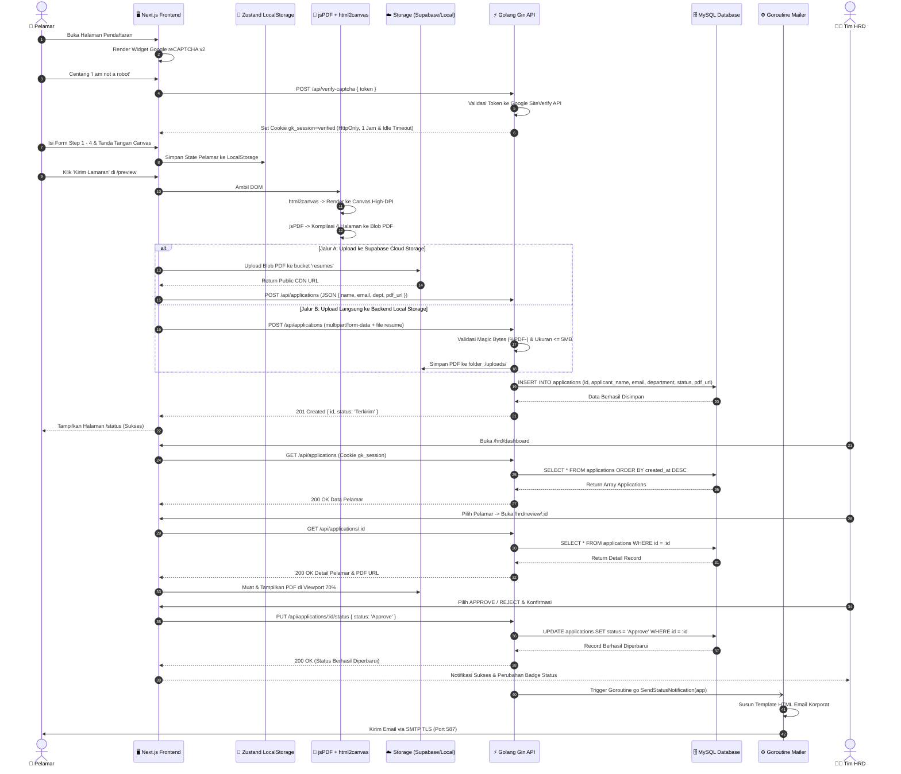
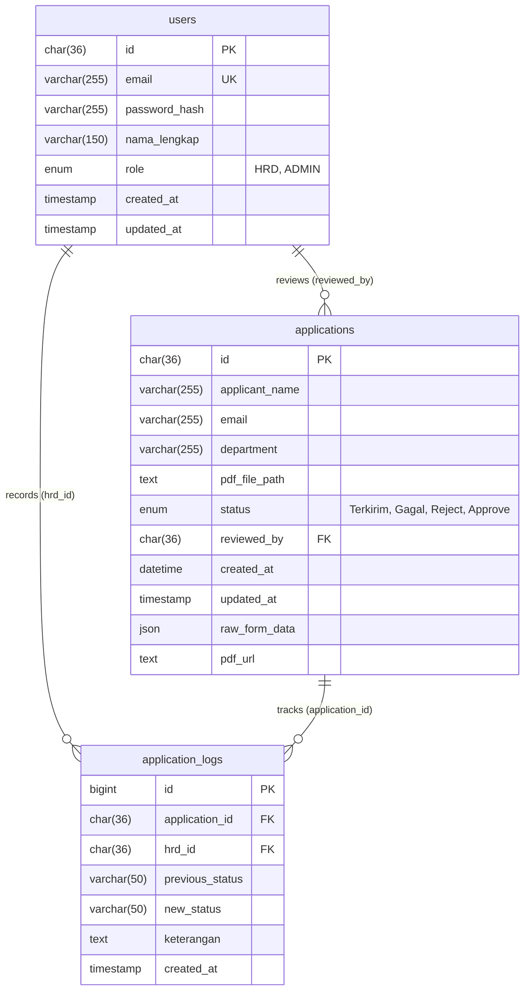

# 📋 Sistem Rekrutmen & Pelamaran Kerja — PT Adiprima Suraprinta

[](https://nextjs.org/)
[](https://react.dev/)
[](https://www.typescriptlang.org/)
[](https://tailwindcss.com/)
[](https://golang.org/)
[](https://gin-gonic.com/)
[](https://www.mysql.com/)
[](https://gorm.io/)
[](https://developers.google.com/recaptcha)

Sistem Informasi Pelamaran Kerja Digital dan Portal Rekrutmen Terpadu untuk **PT Adiprima Suraprinta**. Platform ini memodernisasi seluruh proses penerimaan calon tenaga kerja baru—mulai dari formulir digital bertahap (*multi-step wizard*), tanda tangan digital interaktif, konversi otomatis berkas fisik 4 halaman A4 ke dokumen PDF resmi beresolusi tinggi, sistem keamanan anti-bot **Gatekeeper reCAPTCHA v2**, penyimpanan basis data **MySQL 8** berperforma tinggi, hingga **Dashboard HRD Split-Screen Review** dengan notifikasi email otomatis berbasis **Goroutine**.

---

## 📑 Daftar Isi

- [💡 Tentang Proyek](#-tentang-proyek)
- [🛠️ Teknologi yang Digunakan (Tech Stack)](#️-teknologi-yang-digunakan-tech-stack)
- [🔄 Alur Kerja Sistem (System Workflow)](#-alur-kerja-sistem-system-workflow)
  - [1. Diagram Alur Kerja End-to-End](#1-diagram-alur-kerja-end-to-end)
  - [2. Alur Pelamar Kerja (Job Seeker Workflow)](#2-alur-pelamar-kerja-job-seeker-workflow)
  - [3. Alur Tim HRD / Rekruter (Recruiter Workflow)](#3-alur-tim-hrd--rekruter-recruiter-workflow)
- [🌊 Aliran Data Sistem (Data Flow Architecture)](#-aliran-data-sistem-data-flow-architecture)
  - [1. Diagram Aliran Data (Data Flow Diagram - Sequence)](#1-diagram-aliran-data-data-flow-diagram---sequence)
  - [2. Diagram Arsitektur Pemrosesan Data (Component Data Flow)](#2-diagram-arsitektur-pemrosesan-data-component-data-flow)
  - [3. Tabel Rincian Pipeline Pemrosesan Data](#3-tabel-rincian-pipeline-pemrosesan-data)
- [🗄️ Struktur Basis Data (Database Schema)](#️-struktur-basis-data-database-schema)
  - [1. Spesifikasi Tabel: `applications`](#1-spesifikasi-tabel-applications)
  - [2. Script SQL DDL (MySQL 8)](#2-script-sql-ddl-mysql-8)
  - [3. Arsitektur UUIDv4 pada MySQL & Go Driver](#3-arsitektur-uuidv4-pada-mysql--go-driver)
  - [4. Struktur Data Formulir Pelamar (Zustand & Zod Schema)](#4-struktur-data-formulir-pelamar-zustand--zod-schema)
- [✨ Fitur-Fitur Utama Sistem](#-fitur-fitur-utama-sistem)
- [📁 Struktur Direktori Proyek](#-struktur-direktori-proyek)
- [🔌 Daftar Endpoint API Backend](#-daftar-endpoint-api-backend)
- [🚀 Panduan Instalasi & Menjalankan Proyek (Installation Guide)](#-panduan-instalasi--menjalankan-proyek-installation-guide)
  - [1. Prasyarat Sistem](#1-prasyarat-sistem)
  - [2. Persiapan Basis Data MySQL](#2-persiapan-basis-data-mysql)
  - [3. Konfigurasi & Menjalankan Backend (Golang)](#3-konfigurasi--menjalankan-backend-golang)
  - [4. Konfigurasi & Menjalankan Frontend (Next.js)](#4-konfigurasi--menjalankan-frontend-nextjs)
  - [5. Verifikasi Instalasi & Akses Halaman](#5-verifikasi-instalasi--akses-halaman)
- [🔒 Variabel Lingkungan (Environment Variables)](#-variabel-lingkungan-environment-variables)
- [❓ Solusi Kendala Umum (Troubleshooting & FAQ)](#-solusi-kendala-umum-troubleshooting--faq)
- [📄 Lisensi & Hak Cipta](#-lisensi--hak-cipta)

---

## 💡 Tentang Proyek

Sebelum sistem ini dibangun, formulir lamaran kerja di **PT Adiprima Suraprinta** menggunakan dokumen fisik cetak sebanyak 4 lembar A4 (`No. Dokumen: APS-HRD-F-001`) yang harus diisi pelamar secara manual dengan pulpen. Dokumen tersebut mencakup data pribadi, riwayat pendidikan formal dan non-formal, pengalaman kerja terdahulu dan organisasi, 23 pertanyaan esai kualifikasi, preferensi kerja pabrik, pas foto fisik, hingga tanda tangan basah.

Tantangan utama sistem manual:
- Risiko kerusakan fisik atau tercecernya berkas lamaran kertas.
- Pengarsipan data pelamar yang lambat dan memakan ruang fisik.
- Proses review berkas kandidat yang memakan waktu lama karena harus memeriksa tumpukan berkas secara bergantian.
- Komunikasi hasil seleksi manual yang membebani tim HRD.

**Sistem ini mendigitalisasi seluruh proses tersebut secara menyeluruh tanpa mengubah format standar baku dokumen perusahaan**:
1. **Digitalisasi Form Fisik 4 Tahap**: Pelamar mengisi data melalui antarmuka responsif yang terbagi dalam 4 langkah intuitif dengan validasi data ketat (*Zod* & *React Hook Form*).
2. **Standardized 4-Page A4 PDF Engine**: Browser me-render dokumen cetak standar 4 halaman A4 dengan tata letak resmi perusahaan (*layout*, logo, tabel, pas foto, dan tanda tangan digital) secara otomatis di latar belakang menjadi dokumen PDF beresolusi tinggi tanpa membuka dialog printer browser.
3. **Penyimpanan Berkas Fleksibel**: Berkas PDF dapat disimpan ke **Supabase Cloud Storage** atau ke **Local Disk Storage** backend dengan verifikasi tanda tangan berkas (*magic bytes* `%PDF-`).
4. **Keamanan Anti-Bot Gatekeeper**: Melindungi formulir dan endpoint API dari serangan bot dan *spamming* menggunakan Google reCAPTCHA v2 dan *HTTP-only session cookie*.
5. **Dashboard HRD Split-Screen Review**: Tim HRD dapat meninjau dokumen PDF di sisi kiri layar (70% *viewport*) dan ringkasan data kandidat serta tombol aksi keputusan (*Approve* / *Reject*) di sisi kanan layar (30% *viewport*).
6. **Notifikasi Email Asinkron (Goroutine)**: Keputusan HRD langsung memicu pengiriman email resmi bernuansa korporat ke pelamar melalui latar belakang (*background worker*) tanpa memperlambat respons antarmuka admin.

---

## 🛠️ Teknologi yang Digunakan (Tech Stack)

### 1. Frontend (`portal-rekrutmen`)

| Kategori | Teknologi / Pustaka | Versi | Peran & Kegunaan |
|---|---|---|---|
| **Core Framework** | [Next.js](https://nextjs.org/) | `16.3.3` | React Framework (App Router, Server Components & Client Hydration). |
| **UI Library** | [React](https://react.dev/) & [React DOM](https://react.dev/) | `19.2.8` | Library UI inti untuk rendering komponen. |
| **Language** | [TypeScript](https://www.typescriptlang.org/) | `^5.x` | Menjamin type safety dan maintainability kode. |
| **Styling** | [Tailwind CSS](https://tailwindcss.com/) | `^4.x` | Styling antarmuka modern dengan `@tailwindcss/postcss`. |
| **State Management** | [Zustand](https://zustand-demo.pmnd.rs/) | `^5.0.15` | Global store dengan LocalStorage persistence (`zustand/middleware`). |
| **Form Handling** | [React Hook Form](https://react-hook-form.com/) | `^7.86.0` | Manajemen form performa tinggi dan isolasi re-render. |
| **Schema Validation** | [Zod](https://zod.dev/) | `^4.4.3` | Skema validasi data formulir bertingkat (Step 1 s/d Step 4). |
| **Form Resolver** | `@hookform/resolvers` | `^5.9.1` | Bridge antara validasi skema Zod dan React Hook Form. |
| **PDF Generation** | [jsPDF](https://github.com/parallax/jsPDF) | `^4.2.1` | Mengompilasi 4 halaman canvas DOM menjadi dokumen PDF multi-halaman A4. |
| **HTML to Canvas** | [html2canvas](https://html2canvas.hertzen.com/) | `^1.4.1` | Mengubah elemen visual HTML 4 halaman cetak menjadi canvas beresolusi tinggi. |
| **Direct Printing** | [react-to-print](https://github.com/gregnb/react-to-print) | `^3.3.0` | Fasilitas cetak langsung melalui dialog printer browser di halaman preview. |
| **Digital Signature** | [react-signature-canvas](https://github.com/agilgur5/react-signature-canvas) | `^1.1.0-alpha.2` | Kanvas tanda tangan digital pelamar (dukungan mouse & layar sentuh HP). |
| **Anti-Bot Widget** | [react-google-recaptcha](https://github.com/dozoisch/react-google-recaptcha) | `^3.1.0` | Komponen visual Google reCAPTCHA v2 (*"I'm not a robot"*). |
| **Cloud Storage Client** | [@supabase/supabase-js](https://supabase.com/docs/reference/javascript) | `^2.112.4` | Klien JavaScript untuk upload berkas PDF ke bucket `resumes` Supabase. |
| **ID Generator** | [nanoid](https://github.com/ai/nanoid) | `^5.1.16` | Pembuat ID unik lokal instan. |
| **Linter** | [ESLint](https://eslint.org/) | `^9.x` | Penjaga kualitas kode dengan preset `eslint-config-next`. |

### 2. Backend (`backend`)

| Kategori | Teknologi / Pustaka | Versi | Peran & Kegunaan |
|---|---|---|---|
| **Runtime & Language** | [Golang](https://go.dev/) | `1.24.0` *(Go 1.22+)* | Bahasa pemrograman backend berkecepatan tinggi, hemat memori, dan konkurensi native. |
| **Web Framework** | [Gin Gonic](https://gin-gonic.com/) | `v1.10.0` | HTTP web framework berkecepatan tinggi untuk RESTful API dan routing. |
| **CORS Handler** | `github.com/gin-contrib/cors` | `v1.7.2` | Konfigurasi CORS lintas origin (`http://localhost:3000`) dan dukungan *credentials*. |
| **ORM** | [GORM](https://gorm.io/) | `v1.30.0` | ORM untuk pemodelan data relasional, query builder, dan migrasi skema. |
| **Database Driver** | [GORM MySQL Driver](https://github.com/go-gorm/mysql) | `v1.6.0` | Driver MySQL resmi untuk GORM (berbasis `go-sql-driver/mysql v1.10.1`). |
| **Email Service** | [Gomail.v2](https://gopkg.in/gomail.v2) | `v2.0.0` | Pengiriman email notifikasi keputusan HRD (*Approve* / *Reject*) via SMTP TLS. |
| **Environment Loader** | [godotenv](https://github.com/joho/godotenv) | `v1.5.1` | Membaca konfigurasi variabel lingkungan dari berkas `.env`. |
| **Authentication & Token** | [golang-jwt/jwt/v5](https://github.com/golang-jwt/jwt) | `v5.3.1` | Penerbitan dan validasi JSON Web Token (JWT) sesi login HRD (24 jam). |
| **Password Hashing** | [golang.org/x/crypto/bcrypt](https://pkg.go.dev/golang.org/x/crypto/bcrypt) | `v0.56.0` | Algoritma hashing kata sandi akun HRD satu arah yang tahan serangan brute-force. |

### 3. Database & Storage Architecture
- **Database Utama**: **MySQL 8.x** (Engine: `InnoDB`, Charset: `utf8mb4`, Collation: `utf8mb4_unicode_ci`).
- **Storage Berkas PDF**:
  - **Local Disk Backend**: Disimpan di direktori `./uploads/` dengan validasi *magic bytes* `%PDF-` dan disajikan via rute statis `GET /uploads/:filename`.
  - **Cloud Object Storage**: Terhubung opsional ke **Supabase Cloud Storage** (Bucket: `resumes`).

---

## 🔄 Alur Kerja Sistem (System Workflow)

Sistem rekrutmen ini mengintegrasikan dua alur pengguna utama: **Pelamar Kerja (Job Seeker)** dan **Tim HRD (Recruitment Admin)**.

### 1. Diagram Alur Kerja End-to-End

```mermaid
flowchart TD
    %% Pelamar Section
    subgraph Pelamar ["👤 ALUR PELAMAR KERJA (Job Seeker Workflow)"]
        A[Buka Portal Rekrutmen] --> B{Gatekeeper Shield reCAPTCHA v2}
        B -- Belum Lolos --> B1[Centang 'I am not a robot']
        B1 --> B2[Kirim Token ke /api/verify-captcha]
        B2 --> B3[Backend Terbitkan Cookie gk_session HttpOnly]
        B3 --> C[Akses Landing Page Publik]
        B -- Sudah Lolos --> C

        C --> D[Klik 'Mulai Pendaftaran' -> Buka /apply]
        D --> D1[Step 1: Data Pribadi, Alamat & Upload Pas Foto]
        D1 --> D2[Step 2: Pendidikan Formal & Kursus Non-Formal]
        D2 --> D3[Step 3: Pengalaman Kerja, Organisasi & 23 Esai]
        D3 --> D4[Step 4: Pilihan Dept, Ekspektasi Gaji & Tanda Tangan Canvas]
        
        D4 --> E[Halaman Pratinjau Dokumen /preview]
        E --> F{Pilihan Pelamar di /preview}
        F -- Ingin Koreksi --> D1
        F -- Butuh Salinan Cetak --> F1[Cetak Fisik via react-to-print]
        F -- Kirim Lamaran --> G[Klik 'Kirim Lamaran Sekarang']
        
        G --> H[Engine jsPDF + html2canvas Render DOM 4 Halaman A4]
        H --> I[Bentuk Binary Blob Dokumen PDF]
        I --> J[Upload PDF ke Storage Supabase atau Local Disk Backend]
        J --> K[POST /api/applications ke Backend Golang]
        K --> L[Simpan Record ke MySQL - Status Default: Terkirim]
        L --> M[Alihkan ke /status - Lacak Lamaran]
    end

    %% HRD Section
    subgraph HRD ["🧑‍💼 ALUR TIM HRD (Recruitment Admin Workflow)"]
        N[Buka Dashboard HRD /hrd/dashboard] --> O[Lihat Metrik Statistik Total, Pending, Lolos, Gugur]
        O --> P[Gunakan Toolbar Pencarian & Multi-Filter Dept / Status]
        P --> Q[Pilih Salah Satu Pelamar -> Klik 'Review Berkas']
        
        Q --> R[Buka Panel Split-Screen /hrd/review/:id]
        R --> R1[70% Viewport: Penampil PDF Interaktif 4 Halaman Asli]
        R --> R2[30% Viewport: Ringkasan Data Diri & Tombol Aksi]
        
        R2 --> S{Evaluasi Kualifikasi Pelamar}
        S -- Memenuhi Syarat --> T1[Klik Tombol APPROVE]
        S -- Belum Memenuhi --> T2[Klik Tombol REJECT]
        
        T1 & T2 --> U[Modal Konfirmasi Keamanan Pencegah Salah Klik]
        U --> V[Konfirmasi Eksekusi Keputusan]
        
        V --> W[PUT /api/applications/:id/status ke Backend]
        W --> X[Update Kolom Status di Basis Data MySQL]
        X --> Y[API Kembalikan Respons Instan 200 OK ke HRD UI]
        
        X -.-> Z[Pemicu Goroutine Background Worker]
        Z --> AA[Susun Template HTML Resmi PT Adiprima Suraprinta]
        AA --> AB[Kirim Email via SMTP Gomail TLS Port 587]
        AB --> AC[Email Notifikasi Diterima di Inbox Pelamar]
    end
```



---

### 2. Alur Pelamar Kerja (Job Seeker Workflow)

1. **Tahap 0: Verifikasi Keamanan Anti-Bot (Gatekeeper reCAPTCHA)**:
   - Pelamar membuka portal rekrutmen. Komponen `GatekeeperCaptcha` melindungi akses seluruh rute.
   - Pelamar menyelesaikan tantangan Google reCAPTCHA v2.
   - Token dikirimkan ke endpoint `POST /api/verify-captcha`. Server Google memvalidasi token, dan backend menerbitkan *session cookie* `gk_session=verified` (*HttpOnly*, 1 jam dengan deteksi inaktivitas). Jika tidak ada aktivitas pengguna selama 1 jam, sistem otomatis mengunci akses dan kembali ke halaman verifikasi CAPTCHA.
   - Setelah lolos, pelamar diarahkan masuk ke Landing Page.

2. **Tahap 1: Pengisian Formulir Bertahap (Multi-Step Wizard di `/apply`)**:
   - **Langkah 1 (Data Pribadi)**: Mengisi NIK KTP, NPWP, nama lengkap, kontak WhatsApp, email, alamat KTP, alamat domisili, data fisik (tinggi/berat badan), riwayat penyakit, serta mengunggah pas foto (fitur *circular crop preview* otomatis).
   - **Langkah 2 (Riwayat Pendidikan)**: Input dinamis riwayat pendidikan formal (SD, SMP, SMA/SMK, D3/S1/S2) dan pelatihan/kursus non-formal bersertifikat.
   - **Langkah 3 (Pengalaman & Esai)**: Mengisi riwayat pekerjaan (nama perusahaan, posisi, periode, gaji terakhir, alasan resign), pengalaman organisasi, dan **23 pertanyaan esai kualifikasi, visi, integritas, dan ketahanan kerja**.
   - **Langkah 4 (Minat & Persetujuan)**: Memilih departemen prioritas 1 & 2, ekspektasi gaji, kuesioner kesediaan 3-shift pabrik & penempatan dinas, serta menandatangani dokumen secara digital di atas *signature pad canvas*.
   - **Fitur Autosave State**: Seluruh data yang diisi tersimpan otomatis di **LocalStorage via Zustand Persist**. Jika perangkat mati atau halaman tidak sengaja ter-refresh, data pelamar tetap tersimpan aman.

3. **Tahap 2: Pratinjau Dokumen Baku 4 Halaman A4 (`/preview`)**:
   - Pelamar dapat memeriksa kesesuaian data formulir dalam format dokumen resmi cetak PT Adiprima Suraprinta (`No. Dokumen: APS-HRD-F-001`) lengkap dengan kop surat, tabel grid terstandarisasi, pas foto, dan tanda tangan digital.
   - Tersedia tombol **Cetak Fisik** (*react-to-print*) untuk kebutuhan arsip cetak mandiri.

4. **Tahap 3: Pengiriman Berkas & Data (*Submission*)**:
   - Saat tombol **"Kirim Lamaran Sekarang"** diklik, script `pdfGenerator.ts` secara otomatis mengambil 4 elemen DOM (`#print-page-1..4`) dan merendernya di latar belakang menjadi dokumen PDF 4 halaman A4 beresolusi tinggi menggunakan `html2canvas` dan `jsPDF`.
   - File PDF diunggah ke storage (Supabase Storage bucket `resumes` atau direktori lokal backend `./uploads`).
   - Data pelamar beserta URL berkas dikirimkan ke endpoint `POST /api/applications`.
   - Backend memvalidasi data dan menyimpannya ke MySQL dengan status awal `Terkirim`.

5. **Tahap 4: Pelacakan Status Lamaran (`/status`)**:
   - Pelamar dialihkan ke halaman pelacakan status dengan animasi visual informatif:
     - `Terkirim`: Indikator jam kuning (sedang dalam proses peninjauan berkas oleh HRD).
     - `Approve`: Indikator centang hijau (lolos seleksi awal dan menunggu jadwal tes/wawancara).
     - `Reject`: Surat pemberitahuan penolakan yang santun dan penghargaan atas minat pelamar.
   - Dilengkapi tombol **"Segarkan Status"** untuk sinkronisasi data langsung dengan server backend.

---

### 3. Alur Tim HRD / Rekruter (Recruiter Workflow)

1. **Tahap 1: Akses Dashboard & Pemantauan Statistik (`/hrd/dashboard`)**:
   - Tim HRD membuka dashboard rekrutmen.
   - Melihat 4 metrik kartu statistik secara real-time:
     - **Total Pelamar Masuk**
     - **Berkas Menunggu Review (`Terkirim`)**
     - **Pelamar Lolos Seleksi (`Approve`)**
     - **Pelamar Gugur (`Reject`)**

2. **Tahap 2: Pencarian Cepat & Multi-Filtering**:
   - Melakukan pencarian instan berdasarkan nama pelamar, alamat email, atau ID lamaran.
   - Memfilter pelamar berdasarkan departemen (misal: *Engineering*, *Produksi*, *IT*, *HRD*) dan status seleksi.

3. **Tahap 3: Pemeriksaan Berkas Split-Screen (`/hrd/review/[id]`)**:
   - HRD mengeklik tombol **"Review Berkas"** pada salah satu pelamar di tabel.
   - Layar menampilkan tata letak *split-screen* terpadu:
     - **Sisi Kiri (70% Layar)**: Penampil PDF interaktif yang memuat berkas PDF 4 halaman asli milik kandidat secara langsung di browser tanpa perlu mengunduh terlebih dahulu (lengkap dengan opsi buka tab baru & download).
     - **Sisi Kanan (30% Layar)**: Panel ringkasan profil kandidat, departemen yang dilamar, tanggal pengiriman lamaran, badge status saat ini, dan tombol keputusan seleksi.

4. **Tahap 4: Pengambilan Keputusan (Approve / Reject) & Modal Konfirmasi**:
   - HRD menekan tombol **APPROVE** (jika memenuhi kriteria) atau **REJECT** (jika belum sesuai).
   - Sistem memunculkan **Modal Konfirmasi Keamanan** untuk mencegah kesalahan klik yang tidak disengaja.
   - Saat dikonfirmasi, frontend memanggil endpoint `PUT /api/applications/:id/status`.

5. **Tahap 5: Eksekusi Background Worker & Notifikasi Email Otomatis**:
   - Backend Golang segera mengupdate status di MySQL dan langsung mengembalikan respons `200 OK` ke browser HRD.
   - Secara bersamaan, sebuah *Goroutine* asinkron memicu `EmailService` untuk mengirimkan email HTML resmi PT Adiprima Suraprinta ke alamat email pelamar melalui protokol SMTP TLS:
     - **Status Approve**: Email bertema hijau dengan ucapan selamat dan instruksi persiapan tahap tes/wawancara selanjutnya.
     - **Status Reject**: Email penolakan santun bertema korporat abu-abu yang menyatakan bahwa data pelamar tetap tersimpan dalam *talent pool* perusahaan.

6. **Tahap 6: Manajemen & Pembersihan Data**:
   - Jika ada data lamaran yang keliru atau duplikat, HRD dapat menekan tombol **Hapus** pada tabel.
   - Backend akan menghapus record dari MySQL sekaligus membersihkan berkas PDF terkait dari penyimpanan disk secara otomatis.

---

## 🌊 Aliran Data Sistem (Data Flow Architecture)

### 1. Diagram Aliran Data (Data Flow Diagram - Sequence)

Diagram sequence berikut merinci aliran data teknis dari browser pelamar hingga notifikasi diterima di kotak masuk email:



---

### 2. Diagram Arsitektur Pemrosesan Data (Component Data Flow)

```
[ BROWSER PELAMAR ]
  ├── 1. Gatekeeper Shield  ──► POST /api/verify-captcha ──► Google reCAPTCHA Server
  │                                                                 │
  │   ◄──────────────── Cookie HttpOnly gk_session ─────────────────┘
  │
  ├── 2. Multi-Step Form    ──► React Hook Form + Zod Validasi
  │                                    │
  │   ◄──────── Simpan State ──────────┴──► Zustand Store (LocalStorage)
  │
  └── 3. Submit Engine      ──► DOM 4 Halaman A4 (#print-page-1..4)
                                       │
                                html2canvas (DOM to Canvas)
                                       │
                                jsPDF (Canvas to Multi-page PDF Blob)
                                       │
                 ┌─────────────────────┴─────────────────────┐
                 ▼                                           ▼
      [ JALUR CLOUD STORAGE ]                     [ JALUR LOCAL BACKEND ]
      Upload ke Supabase Storage                  POST /api/applications
      Bucket: 'resumes'                           Format: multipart/form-data
                 │                                           │
      Dapatkan Public CDN URL                     Backend Validasi Magic Bytes (%PDF-)
                 │                                Simpan ke Disk ./uploads/{uuid}.pdf
                 ▼                                           │
      POST /api/applications (JSON)                          │
                 │                                           │
                 └─────────────────────┬─────────────────────┘
                                       │
                                       ▼
                       [ GOLANG GIN REST API (Port 8080) ]
                         ├── Middleware: GatekeeperAuth (Cek Cookie)
                         ├── Controller: ApplicationController
                         └── ORM Layer: GORM
                                       │
                                       ▼
                       [ MYSQL 8 DATABASE (Port 3306) ]
                         └── Tabel: `applications` (CHAR(36) UUIDv4)
                                       │
                                       ▼
                       [ HRD SPLIT-SCREEN REVIEW PANEL ]
                         ├── GET /api/applications (Dashboard List & Filter)
                         ├── GET /api/applications/:id (Detail & PDF View 70%)
                         └── PUT /api/applications/:id/status (Approve / Reject)
                                       │
                                       ▼
                       [ ASYNCHRONOUS GOROUTINE WORKER ]
                         └── Gomail SMTP TLS (Port 587)
                                       │
                                       ▼
                       [ KOTAK MASUK EMAIL PELAMAR ]
                         └── Email Template HTML (Approve / Reject)
```

---

### 3. Tabel Rincian Pipeline Pemrosesan Data

| No | Pipeline Pemrosesan | Input Data | Komponen Pemroses | Output / Penyimpanan |
|---|---|---|---|---|
| **1** | **Verifikasi Anti-Bot** | Token respons reCAPTCHA dari browser | `POST /api/verify-captcha` ➔ Google Verify API | Cookie HTTP-Only `gk_session=verified` (1 jam / idle timeout) |
| **2** | **Validasi & Cache Form** | Input pengguna pada Step 1 - 4 | `React Hook Form` + skema validasi `Zod` | Global Store `Zustand` & `LocalStorage` browser |
| **3** | **Konversi PDF Multi-Page** | Elemen HTML DOM `#print-page-1` s/d `#print-page-4` | `html2canvas` (DPI: 2) + `jsPDF` (Format: A4 Portrait) | Binary Blob `application/pdf` (~1.5 MB - 3 MB) |
| **4** | **Penyimpanan Berkas PDF** | Binary Blob PDF | Supabase Storage SDK / Gin `FormFile("resume")` | Public CDN URL atau berkas disk lokal `./uploads/{uuid}.pdf` |
| **5** | **Penyimpanan Metadata** | JSON atau Multipart FormData | Gin Controller ➔ GORM ORM | Record baru pada tabel `applications` di basis data MySQL |
| **6** | **Query Dashboard HRD** | Parameter query `?department=&status=` | Gin Controller ➔ GORM `Where()` & `Order()` | Response JSON array pelamar terurut waktu terbaru |
| **7** | **Keputusan Seleksi HRD** | JSON `{ status: "Approve" \| "Reject" }` | Gin Controller ➔ GORM `Update("status")` | Kolom `status` terupdate di basis data MySQL |
| **8** | **Disposisi Email Notifikasi**| Record data pelamar (Nama, Email, Departemen, Status) | `Goroutine` ➔ `services.EmailService` ➔ Gomail v2 | Email HTML terkirim via protokol SMTP TLS ke kandidat |

---

## 🗄️ Struktur Basis Data (Database Schema)

Aplikasi menggunakan basis data relasional **MySQL 8.x** (database: `pelamar_kerja`, engine: **InnoDB**, charset: **`utf8mb4`**). Sistem terdiri dari 3 tabel yang saling berelasi:



### 1. Spesifikasi Tabel: `users`
Tabel penyimpan kredensial dan hak akses administrator / HRD:

| Nama Kolom | Tipe Data MySQL | Nullable | Keterangan |
|---|---|:---:|---|
| `id` | `CHAR(36)` | **NO** | **Primary Key** UUID v4. |
| `email` | `VARCHAR(255)` | **NO** | Alamat email HRD (Unique Index). |
| `password_hash` | `VARCHAR(255)` | **NO** | Hash kata sandi bcrypt satu arah. |
| `nama_lengkap` | `VARCHAR(150)` | **NO** | Nama personil HRD yang bertugas. |
| `role` | `ENUM('HRD','ADMIN')` | **NO** | Hak akses (`HRD` atau `ADMIN`). |
| `created_at` | `TIMESTAMP` | **NO** | Waktu pembuatan akun. |
| `updated_at` | `TIMESTAMP` | **NO** | Waktu pembaruan akun. |

---

### 2. Spesifikasi Tabel: `applications`
Tabel penyimpan data formulir pendaftaran dan berkas pelamar kerja:

| Nama Kolom | Tipe Data MySQL | Nullable | Keterangan |
|---|---|:---:|---|
| `id` | `CHAR(36)` | **NO** | **Primary Key** UUID v4 36 karakter. |
| `applicant_name` | `VARCHAR(255)` | **NO** | Nama lengkap pelamar sesuai KTP. |
| `email` | `VARCHAR(255)` | **NO** | Alamat email aktif kandidat (Indexed). |
| `department` | `VARCHAR(255)` | **NO** | Departemen yang dilamar (misal: *Engineering*, *IT*). |
| `pdf_file_path` | `TEXT` | **NO** | Path lokal file PDF atau fallback identifier berkas. |
| `status` | `ENUM('Terkirim','Gagal','Reject','Approve')` | **NO** | Status alur rekrutmen. Default: `'Terkirim'`. |
| `reviewed_by` | `CHAR(36)` | **YES** | **Foreign Key** ke `users.id` yang mereviu lamaran. |
| `created_at` | `DATETIME` | **NO** | Waktu pengiriman lamaran. |
| `updated_at` | `TIMESTAMP` | **NO** | Waktu pembaruan status / data. |
| `raw_form_data` | `JSON` | **YES** | Payload JSON mentah berisi 23 esai kualifikasi & data form. |
| `pdf_url` | `TEXT` | **YES** | URL akses berkas PDF (CDN / Cloud / Local server). |

---

### 3. Spesifikasi Tabel: `application_logs`
Tabel audit trail riwayat perubahan status lamaran oleh HRD:

| Nama Kolom | Tipe Data MySQL | Nullable | Keterangan |
|---|---|:---:|---|
| `id` | `BIGINT` | **NO** | **Primary Key** Auto Increment. |
| `application_id` | `CHAR(36)` | **NO** | **Foreign Key** ke `applications.id`. |
| `hrd_id` | `CHAR(36)` | **YES** | **Foreign Key** ke `users.id` yang mengubah status. |
| `previous_status` | `VARCHAR(50)` | **YES** | Status lamaran sebelum perubahan. |
| `new_status` | `VARCHAR(50)` | **NO** | Status lamaran baru (`Approve` / `Reject`). |
| `keterangan` | `TEXT` | **YES** | Catatan / alasan perubahan status. |
| `created_at` | `TIMESTAMP` | **NO** | Waktu pencatatan log (Audit Trail). |

---

### 4. Script SQL DDL (MySQL 8)

```sql
CREATE DATABASE IF NOT EXISTS `pelamar_kerja`
CHARACTER SET utf8mb4
COLLATE utf8mb4_unicode_ci;

USE `pelamar_kerja`;

-- 1. Tabel users
CREATE TABLE IF NOT EXISTS `users` (
    `id` CHAR(36) NOT NULL,
    `email` VARCHAR(255) NOT NULL,
    `password_hash` VARCHAR(255) NOT NULL,
    `nama_lengkap` VARCHAR(150) NOT NULL,
    `role` ENUM('HRD', 'ADMIN') NOT NULL DEFAULT 'HRD',
    `created_at` TIMESTAMP NOT NULL DEFAULT CURRENT_TIMESTAMP,
    `updated_at` TIMESTAMP NOT NULL DEFAULT CURRENT_TIMESTAMP ON UPDATE CURRENT_TIMESTAMP,
    PRIMARY KEY (`id`),
    UNIQUE KEY `idx_users_email` (`email`)
) ENGINE=InnoDB DEFAULT CHARSET=utf8mb4 COLLATE=utf8mb4_unicode_ci;

-- 2. Tabel applications
CREATE TABLE IF NOT EXISTS `applications` (
    `id` CHAR(36) NOT NULL,
    `applicant_name` VARCHAR(255) NOT NULL,
    `email` VARCHAR(255) NOT NULL,
    `department` VARCHAR(255) NOT NULL,
    `pdf_file_path` TEXT NOT NULL,
    `status` ENUM('Terkirim', 'Gagal', 'Reject', 'Approve') NOT NULL DEFAULT 'Terkirim',
    `reviewed_by` CHAR(36) DEFAULT NULL,
    `created_at` DATETIME NOT NULL DEFAULT CURRENT_TIMESTAMP,
    `updated_at` TIMESTAMP NOT NULL DEFAULT CURRENT_TIMESTAMP ON UPDATE CURRENT_TIMESTAMP,
    `raw_form_data` JSON DEFAULT NULL,
    `pdf_url` TEXT DEFAULT NULL,
    PRIMARY KEY (`id`),
    KEY `idx_applications_email` (`email`),
    KEY `idx_applications_department` (`department`),
    KEY `idx_applications_reviewed_by` (`reviewed_by`),
    CONSTRAINT `fk_applications_reviewed_by` FOREIGN KEY (`reviewed_by`) REFERENCES `users` (`id`) ON DELETE SET NULL ON UPDATE CASCADE
) ENGINE=InnoDB DEFAULT CHARSET=utf8mb4 COLLATE=utf8mb4_unicode_ci;

-- 3. Tabel application_logs
CREATE TABLE IF NOT EXISTS `application_logs` (
    `id` BIGINT NOT NULL AUTO_INCREMENT,
    `application_id` CHAR(36) NOT NULL,
    `hrd_id` CHAR(36) DEFAULT NULL,
    `previous_status` VARCHAR(50) DEFAULT NULL,
    `new_status` VARCHAR(50) NOT NULL,
    `keterangan` TEXT DEFAULT NULL,
    `created_at` TIMESTAMP NOT NULL DEFAULT CURRENT_TIMESTAMP,
    PRIMARY KEY (`id`),
    KEY `idx_logs_application_id` (`application_id`),
    KEY `idx_logs_hrd_id` (`hrd_id`),
    CONSTRAINT `fk_logs_application_id` FOREIGN KEY (`application_id`) REFERENCES `applications` (`id`) ON DELETE CASCADE ON UPDATE CASCADE,
    CONSTRAINT `fk_logs_hrd_id` FOREIGN KEY (`hrd_id`) REFERENCES `users` (`id`) ON DELETE SET NULL ON UPDATE CASCADE
) ENGINE=InnoDB DEFAULT CHARSET=utf8mb4 COLLATE=utf8mb4_unicode_ci;
```

---

### 3. Arsitektur UUIDv4 pada MySQL & Go Driver

Secara default, GORM memperlakukan tipe `uuid.UUID` sebagai *binary* `[16]byte`. Untuk menjaga kompatibilitas penuh dengan kolom `CHAR(36)` di MySQL dan memastikan respons JSON terformat dengan rapi, backend mengimplementasikan tipe khusus `UUIDv4`:

```go
type UUIDv4 uuid.UUID

// Value: Mengkonversi UUID menjadi string 36 karakter saat INSERT/UPDATE ke MySQL
func (u UUIDv4) Value() (driver.Value, error) {
    return uuid.UUID(u).String(), nil
}

// Scan: Membaca string CHAR(36) dari MySQL dan mem-parsing-nya kembali ke UUID
func (u *UUIDv4) Scan(value interface{}) error { ... }

// BeforeCreate Hook: Otomatis men-generate UUID baru di layer Go jika belum ditentukan
func (a *Application) BeforeCreate(tx *gorm.DB) error {
    if a.ID == UUIDv4(uuid.Nil) {
        a.ID = UUIDv4(uuid.New())
    }
    return nil
}
```

---

### 4. Struktur Data Formulir Pelamar (Zustand & Zod Schema)

Seluruh data formulir dikelola secara reaktif pada `useBiodataStore.ts` dan divalidasi oleh skema `zod`:

```typescript
// 1. Data Pribadi (Step 1)
interface DataPribadi {
  noKtp: string;              // Nomor Induk Kependudukan (16 digit)
  noNpwp?: string;            // NPWP (opsional)
  namaLengkap: string;        // Nama lengkap sesuai KTP
  namaPanggilan?: string;
  tempatLahir: string;
  tanggalLahir: string;       // Format YYYY-MM-DD
  jenisKelamin: "L" | "P";
  agama: string;
  statusPernikahan: string;
  alamatKtp: string;
  alamatDomisili: string;
  noHp: string;               // Kontak WhatsApp aktif
  email: string;              // Email konfirmasi
  tinggiBadan: number;        // cm
  beratBadan: number;         // kg
  golonganDarah?: string;
  riwayatPenyakit?: string;
}

// 2. Riwayat Pendidikan (Step 2)
interface PendidikanFormal {
  jenjang: "SD" | "SMP" | "SMA/SMK" | "D3" | "S1" | "S2";
  namaSekolah: string;
  jurusan?: string;
  tahunMasuk: string;
  tahunLulus: string;
  nilaiAkhir?: string;       // Nilai UN / IPK kelulusan
}

interface PendidikanNonFormal {
  namaPelatihan: string;
  penyelenggara: string;
  tahun: string;
  sertifikat: boolean;
}

// 3. Rekam Jejak & Esai Kualifikasi (Step 3)
interface PengalamanKerja {
  namaPerusahaan: string;
  posisiTerakhir: string;
  periodeKerja: string;
  gajiTerakhir?: string;
  alasanKeluar?: string;
}

interface PengalamanOrganisasi {
  namaOrganisasi: string;
  jabatan: string;
  periode: string;
}

// Jawaban dari 23 pertanyaan esai kualifikasi standar PT Adiprima Suraprinta
type JawabanEsai = Record<string, string>; // esai_1 s/d esai_23

// 4. Minat & Persetujuan (Step 4)
interface MinatDepartemen {
  departemenPertama: string;  // Departemen Pilihan Utama
  departemenKedua?: string;   // Departemen Pilihan Cadangan
  gajiDiharapkan: string;
  kesediaanShift: boolean;    // Kesediaan pola 3-shift operasional pabrik
  kesediaanDinas: boolean;    // Kesediaan tugas dinas luar kota
}

interface Persetujuan {
  pernyataanBenar: boolean;
  tandaTanganBase64: string; // Data URL format PNG dari Canvas Signature Pad
  tanggalTandaTangan: string;
}
```

---

## ✨ Fitur-Fitur Utama Sistem

### Modul Pelamar (Job Seeker Portal)
- 🎨 **Landing Page Interaktif**: Desain antarmuka berstandar industri dengan pengenalan profil, budaya kerja, dan tahapan rekrutmen PT Adiprima Suraprinta.
- 🛡️ **Gatekeeper reCAPTCHA Shield**: Lapisan pelindung dari bot yang aktif di seluruh portal.
- 📋 **Form Wizard Bertahap (4 Langkah)**: Panduan langkah demi langkah dengan indikator progres visual dan pesan error kontekstual.
- 📸 **Upload Pas Foto & Circular Crop Preview**: Pratinjau pas foto interaktif dengan pemotongan proporsional otomatis.
- ✍️ **Digital Signature Pad**: Kanvas sentuh tanda tangan digital responsif untuk perangkat desktop maupun smartphone.
- 💾 **Autosave State (Zustand Persist)**: Menjaga input formulir pelamar tetap tersimpan aman di browser (*LocalStorage*).
- 🖨️ **Penampil Pratinjau Dokumen 4 Halaman A4 (`/preview`)**: Visualisasi dokumen cetak formal sesuai format asli fisik PT Adiprima Suraprinta (`APS-HRD-F-001`).
- 🔄 **Layanan Lacak Status Dinamis (`/status`)**: Menampilkan status berkas secara langsung (`Terkirim`, `Approve`, `Reject`) lengkap dengan tombol *Live Refresh* dari server.

### Modul HRD (Admin Recruitment Panel)
- 📊 **Panel Statistik Real-Time**: Statistik jumlah pelamar, berkas tertunda, pelamar diterima, dan pelamar gugur.
- 🔍 **Pencarian Cepat & Filter Multi-Kriteria**: Penyaringan kandidat berdasarkan nama, email, ID lamaran, status, maupun departemen tujuan.
- 🖥️ **Split-Screen Review Panel (`/hrd/review/:id`)**:
  - **70% Layar Kiri**: Penampil PDF interaktif untuk membaca seluruh 4 halaman formulir pelamar tanpa perlu mengunduh secara manual.
  - **30% Layar Kanan**: Panel identitas ringkas, tanggal pengiriman, kontak, serta tombol aksi cepat **REJECT** dan **APPROVE**.
- ⚠️ **Modal Konfirmasi Keamanan**: Mencegah kesalahan penekanan tombol keputusan seleksi.
- ⚡ **Pengiriman Notifikasi Asinkron (Goroutine)**: Notifikasi email dikirim secara instan di latar belakang tanpa menimbulkan *blocking latency* pada antarmuka admin.
- 🗑️ **Pembersihan Data & File Terintegrasi**: Menghapus data lamaran dari database sekaligus membersihkan file PDF dari storage.

### Keamanan & Keandalan (Security & Robustness)
- 🍪 **HTTP-Only Session Cookie**: Token sesi verifikasi bot dilindungi dari serangan *Cross-Site Scripting* (XSS).
- 🔒 **CORS Configuration**: Akses API terproteksi dengan pembatasan domain yang aman dan dukungan pengiriman *credentials*.
- 🛡️ **Magic Bytes File Signature Verification**: Pemeriksaan integritas berkas upload berbasis *magic bytes* (`%PDF-`), bukan hanya bergantung pada ekstensi berkas.
- 🚫 **Anti Path-Traversal**: Penamaan file menggunakan UUID acak dan sanitasi path ketat untuk mencegah manipulasi direktori sistem.
- 🏊 **Database Connection Pooling**: Konfigurasi koneksi MySQL optimal (`SetMaxOpenConns`, `SetMaxIdleConns`, `SetConnMaxLifetime`).

---

## 📁 Struktur Direktori Proyek

```
Sistem-Pelamaran-Kerja/
│
├── backend/                                   # Backend Golang (REST API & Mailer)
│   ├── config/
│   │   └── database.go                        # Koneksi GORM MySQL & konfigurasi connection pool
│   ├── controllers/
│   │   ├── application_controller.go          # Handler CRUD, status updater, dan dual-payload parser (JSON & Multipart)
│   │   ├── auth_controller.go                 # Handler autentikasi HRD: Login (JWT HttpOnly), Logout & Session Check
│   │   └── captcha_controller.go              # Verifikasi token reCAPTCHA ke Google API & penerbitan cookie gk_session
│   ├── middleware/
│   │   ├── captcha_auth.go                    # GatekeeperAuth: Validasi cookie gk_session (Alur Pelamar)
│   │   └── hrd_auth.go                        # HRDAuth: Validasi JWT pada cookie hrd_token (Alur Dashboard HRD)
│   ├── models/
│   │   ├── application.go                     # Entitas Application, custom driver UUIDv4 & DTO Request
│   │   └── user.go                            # Entitas User (tabel 'users'), DTO LoginInput, dan custom HRDClaims
│   ├── scripts/
│   │   └── hash_password.go                   # Script CLI generator hash bcrypt untuk insert manual akun HRD
│   ├── services/
│   │   ├── email_service.go                   # Service notifikasi email SMTP asinkron (Approve/Reject)
│   │   └── upload_service.go                  # Service upload PDF lokal (magic bytes %PDF- & sanitasi)
│   ├── uploads/                               # Direktori penyimpanan file PDF lokal (auto-created)
│   ├── .env                                   # Konfigurasi variabel lingkungan backend (termasuk JWT_SECRET)
│   ├── go.mod                                 # Definisi modul & dependensi Go (jwt/v5, bcrypt, gin, gorm)
│   ├── go.sum                                 # Checksum integritas dependensi Go
│   └── main.go                                # Entry point server Gin, registrasi rute & middleware
│
├── portal-rekrutmen/                          # Frontend Next.js 16 (App Router)
│   ├── app/
│   │   ├── apply/
│   │   │   ├── _steps/
│   │   │   │   ├── Step1DataPribadi.tsx       # Form step 1: Biodata, kontak, alamat, fisik & upload foto
│   │   │   │   ├── Step2Pendidikan.tsx         # Form step 2: Riwayat pendidikan formal & pelatihan
│   │   │   │   ├── Step3PengalamanEsai.tsx     # Form step 3: Pengalaman kerja & 23 esai kualifikasi
│   │   │   │   └── Step4MinatPersetujuan.tsx  # Form step 4: Dept pilihan, gaji & tanda tangan canvas
│   │   │   └── page.tsx                        # Komponen orkestrator stepper wizard
│   │   ├── hrd/
│   │   │   ├── login/
│   │   │   │   └── page.tsx                    # Halaman login eksklusif HRD (JWT HttpOnly Auth)
│   │   │   ├── dashboard/
│   │   │   │   └── page.tsx                    # Dashboard utama HRD (Metrik, filter, tabel data & logout)
│   │   │   └── review/
│   │   │       └── [id]/
│   │   │           └── page.tsx                # Split-screen review (70% PDF Viewer + 30% Keputusan)
│   │   ├── preview/
│   │   │   └── page.tsx                        # Pratinjau layout cetak 4 hal A4 & tombol submit
│   │   ├── print/
│   │   │   └── page.tsx                        # Halaman format cetak murni (print dialog ready)
│   │   ├── status/
│   │   │   └── page.tsx                        # Pelacakan status lamaran pelamar secara live
│   │   ├── globals.css                         # Pengaturan style global & Tailwind 4
│   │   ├── layout.tsx                          # Root layout membungkus Gatekeeper wrapper
│   │   └── page.tsx                            # Halaman beranda (landing page publik)
│   ├── components/
│   │   ├── GatekeeperCaptcha.tsx               # Komponen modal anti-bot Google reCAPTCHA v2
│   │   ├── GatekeeperCaptchaWrapper.tsx        # Dynamic client component wrapper (mencegah error SSR)
│   │   ├── PhotoUploader.tsx                   # Komponen upload foto dengan preview circular crop
│   │   ├── SignaturePad.tsx                    # Kanvas tanda tangan digital interaktif
│   │   └── print/
│   │       ├── PrintLayoutPage1.tsx            # Halaman 1 cetak: Data Pribadi & Kontak
│   │       ├── PrintLayoutPage2.tsx            # Halaman 2 cetak: Pendidikan & Pengalaman
│   │       ├── PrintLayoutPage3.tsx            # Halaman 3 cetak: 23 Esai Kualifikasi Bagian 1
│   │       └── PrintLayoutPage4.tsx            # Halaman 4 cetak: 23 Esai Bagian 2 & Tanda Tangan
│   ├── lib/
│   │   ├── pdfGenerator.ts                     # Engine konversi DOM multi-halaman ke PDF Blob
│   │   ├── schemas.ts                          # Skema validasi Zod untuk seluruh tahap form
│   │   ├── submissionService.ts                # Service pengiriman lamaran ke backend / storage
│   │   └── supabaseClient.ts                   # Inisialisasi klien Supabase Storage
│   ├── store/
│   │   └── useBiodataStore.ts                  # Zustand global store dengan LocalStorage persistence
│   ├── public/
│   │   └── logo.jpg                            # Logo resmi PT Adiprima Suraprinta
│   ├── .env.local                              # Konfigurasi variabel lingkungan frontend
│   ├── package.json                            # Dependensi dan script Node.js
│   ├── tsconfig.json                           # Konfigurasi compiler TypeScript
│   ├── next.config.ts                          # Konfigurasi server Next.js
│   └── middleware.ts                           # Next.js Edge Middleware pelindung rute /hrd/* (Cookie check)
│
├── go.work                                     # Go Workspace file
├── go.work.sum                                 # Checksum Go Workspace
└── README.md                                   # Dokumentasi lengkap sistem
```

---

## 🔌 Daftar Endpoint API Backend

Base URL API: `http://localhost:8080`

### 1. Health Check
- **URL**: `GET /health`
- **Akses**: Publik
- **Deskripsi**: Memeriksa ketersediaan dan status server backend.
- **Contoh Response (`200 OK`)**:
  ```json
  {
    "service": "Portal Rekrutmen API",
    "status": "ok"
  }
  ```

---

### 2. Verifikasi Gatekeeper CAPTCHA
- **URL**: `POST /api/verify-captcha`
- **Akses**: Publik
- **Deskripsi**: Memverifikasi token response reCAPTCHA v2 dari browser ke server Google. Jika valid, backend menerbitkan cookie `gk_session=verified` (*HttpOnly*, 1 jam). Jika tidak ada aktivitas selama 1 jam, cookie akan kedaluwarsa dan frontend otomatis kembali menampilkan verifikasi CAPTCHA.
- **Request Headers**: `Content-Type: application/json`
- **Request Body**:
  ```json
  {
    "token": "03AFcWeA6...[token_dari_recaptcha]..."
  }
  ```
- **Contoh Response (`200 OK`)**:
  ```json
  {
    "success": true,
    "message": "Verifikasi CAPTCHA berhasil. Akses sesi diberikan selama 1 jam."
  }
  ```
- **Response Headers**: `Set-Cookie: gk_session=verified; Path=/; Max-Age=3600; HttpOnly`

---

### 2.1. Perpanjang Sesi CAPTCHA (Aktivitas Pengguna)
- **URL**: `POST /api/refresh-captcha-session`
- **Akses**: Publik (Klien dengan cookie `gk_session` aktif)
- **Deskripsi**: Memperpanjang masa aktif cookie `gk_session` menjadi 1 jam ke depan jika pengguna aktif berinteraksi di portal.

---

### 2.2. Invalidate / Reset Sesi CAPTCHA (Inactivity Timeout)
- **URL**: `POST /api/invalidate-captcha-session`
- **Akses**: Publik
- **Deskripsi**: Menghapus cookie `gk_session` seketika saat terdeteksi tidak ada aktivitas selama 1 jam.

---

### 3. Login HRD (Eksklusif Tanpa Registrasi)
- **URL**: `POST /api/hrd/login`
- **Akses**: Publik
- **Deskripsi**: Memverifikasi `email` dan `password` akun HRD ke tabel `users` di MySQL menggunakan `bcrypt.CompareHashAndPassword`. Jika valid, server menerbitkan token JWT (berisi User ID dan Role `HRD` berdurasi 24 jam) yang disimpan dalam cookie HttpOnly bernama `hrd_token`.
- **Request Headers**: `Content-Type: application/json`
- **Request Body**:
  ```json
  {
    "email": "hrd@adiprimasuraprinta.co.id",
    "password": "password_akun_anda"
  }
  ```
- **Contoh Response (`200 OK`)**:
  ```json
  {
    "success": true,
    "message": "Login HRD berhasil. Selamat datang!",
    "data": {
      "id": 1,
      "name": "Admin HRD",
      "email": "hrd@adiprimasuraprinta.co.id",
      "role": "HRD",
      "token": "eyJhbGciOiJIUzI1NiIsInR5cCI6IkpXVCJ9..."
    }
  }
  ```
- **Response Headers**: `Set-Cookie: hrd_token=eyJ...; Path=/; Max-Age=86400; HttpOnly`
- **Error Response (`401 Unauthorized`)**:
  ```json
  {
    "success": false,
    "message": "Email atau password yang Anda masukkan salah"
  }
  ```

---

### 4. Logout HRD
- **URL**: `POST /api/hrd/logout`
- **Akses**: Terproteksi (Memerlukan Cookie `hrd_token`)
- **Deskripsi**: Mengakhiri sesi login HRD dengan menyetel atribut cookie `hrd_token` ke `Max-Age: -1` sehingga terhapus dari browser.
- **Contoh Response (`200 OK`)**:
  ```json
  {
    "success": true,
    "message": "Logout HRD berhasil. Sesi telah diakhiri."
  }
  ```

---

### 5. Cek Status Sesi HRD
- **URL**: `GET /api/hrd/session`
- **Akses**: Terproteksi (Memerlukan Cookie `hrd_token`)
- **Deskripsi**: Memeriksa validitas token JWT HRD saat ini (digunakan oleh antarmuka frontend untuk status login).
- **Contoh Response (`200 OK`)**:
  ```json
  {
    "success": true,
    "authenticated": true,
    "user": {
      "id": 1,
      "email": "hrd@adiprimasuraprinta.co.id",
      "role": "HRD"
    }
  }
  ```

---

### 6. Kirim Lamaran Baru (Create Application)
- **URL**: `POST /api/applications`
- **Akses**: Terproteksi (Memerlukan Cookie `gk_session` — Alur Pelamar)
- **Deskripsi**: Menyimpan berkas dan data lamaran baru dari pelamar. Endpoint ini mendukung **dua format payload**:

#### Format A: JSON Payload (Jika PDF diunggah ke Supabase Storage)
- **Request Headers**: `Content-Type: application/json`
- **Request Body**:
  ```json
  {
    "applicant_name": "Budi Santoso",
    "email": "budi.santoso@example.com",
    "department": "Engineering",
    "pdf_url": "https://xyz.supabase.co/storage/v1/object/public/resumes/budi_santoso_1789.pdf"
  }
  ```

#### Format B: Multipart Form-Data (Upload langsung ke Backend Storage)
- **Request Headers**: `Content-Type: multipart/form-data`
- **Form Fields**:
  - `applicant_name` (string, wajib)
  - `email` (string, wajib)
  - `department` (string, wajib)
  - `resume` (file binary PDF, opsional, maks 5MB)

- **Contoh Response (`201 Created`)**:
  ```json
  {
    "success": true,
    "status": "Terkirim",
    "message": "Lamaran berhasil disimpan",
    "data": {
      "id": "e8d6f1a2-3b4c-4d5e-9f0a-1b2c3d4e5f6a",
      "applicant_name": "Budi Santoso",
      "email": "budi.santoso@example.com",
      "department": "Engineering",
      "status": "Terkirim",
      "pdf_url": "http://localhost:8080/uploads/a1b2c3d4.pdf",
      "created_at": "2026-09-03T10:15:30.123+07:00"
    }
  }
  ```

---

### 7. List Semua Lamaran (Dashboard HRD)
- **URL**: `GET /api/applications`
- **Akses**: Terproteksi (Memerlukan Cookie `hrd_token` — HRD JWT Auth)
- **Deskripsi**: Mengambil seluruh daftar pelamar untuk tabel Dashboard HRD terurut dari yang paling baru (`created_at DESC`).
- **Query Parameters (Opsional)**:
  - `?department=Engineering` — Filter berdasarkan departemen tertentu
  - `?status=Terkirim` — Filter berdasarkan status tertentu (`Terkirim`, `Approve`, `Reject`, `Gagal`)
- **Contoh Response (`200 OK`)**:
  ```json
  {
    "success": true,
    "total": 1,
    "data": [
      {
        "id": "e8d6f1a2-3b4c-4d5e-9f0a-1b2c3d4e5f6a",
        "applicant_name": "Budi Santoso",
        "email": "budi.santoso@example.com",
        "department": "Engineering",
        "status": "Terkirim",
        "pdf_url": "http://localhost:8080/uploads/a1b2c3d4.pdf",
        "created_at": "2026-09-03T10:15:30.123+07:00"
      }
    ]
  }
  ```

---

### 8. Detail Lamaran Tunggal
- **URL**: `GET /api/applications/:id`
- **Akses**: Terproteksi (Memerlukan Cookie `hrd_token` — HRD JWT Auth)
- **Deskripsi**: Mengambil data detail pelamar spesifik berdasarkan UUID untuk panel review HRD.
- **URL Parameter**: `:id` (UUID format 36 karakter)
- **Contoh Response (`200 OK`)**:
  ```json
  {
    "success": true,
    "data": {
      "id": "e8d6f1a2-3b4c-4d5e-9f0a-1b2c3d4e5f6a",
      "applicant_name": "Budi Santoso",
      "email": "budi.santoso@example.com",
      "department": "Engineering",
      "status": "Terkirim",
      "pdf_url": "http://localhost:8080/uploads/a1b2c3d4.pdf",
      "created_at": "2026-09-03T10:15:30.123+07:00"
    }
  }
  ```

---

### 9. Update Status Lamaran & Trigger Email (Review HRD)
- **URL**: `PUT /api/applications/:id/status`
- **Akses**: Terproteksi (Memerlukan Cookie `hrd_token` — HRD JWT Auth)
- **Deskripsi**: Memperbarui status lamaran menjadi `Approve` atau `Reject`. Secara asinkron memicu *Goroutine* untuk mengirimkan email pemberitahuan ke kandidat.
- **Request Headers**: `Content-Type: application/json`
- **Request Body**:
  ```json
  {
    "status": "Approve"
  }
  ```
  *(Nilai status yang diizinkan hanya: `"Approve"` atau `"Reject"`)*
- **Contoh Response (`200 OK`)**:
  ```json
  {
    "success": true,
    "message": "Status pelamar berhasil diperbarui menjadi Approve. Email notifikasi sedang dikirim di latar belakang.",
    "data": {
      "id": "e8d6f1a2-3b4c-4d5e-9f0a-1b2c3d4e5f6a",
      "applicant_name": "Budi Santoso",
      "email": "budi.santoso@example.com",
      "department": "Engineering",
      "status": "Approve"
    }
  }
  ```

---

### 10. Hapus Data Lamaran & Berkas PDF
- **URL**: `DELETE /api/applications/:id`
- **Akses**: Terproteksi (Memerlukan Cookie `hrd_token` — HRD JWT Auth)
- **Deskripsi**: Menghapus data pelamar dari tabel MySQL dan secara otomatis menghapus berkas PDF fisik dari folder `./uploads`.
- **Contoh Response (`200 OK`)**:
  ```json
  {
    "success": true,
    "message": "Data lamaran dan file PDF berhasil dihapus"
  }
  ```

---

### 11. Akses Berkas PDF Statis (Static Serving)
- **URL**: `GET /uploads/:filename`
- **Akses**: Publik / Browser
- **Deskripsi**: Mengunduh atau menampilkan berkas PDF pelamar yang tersimpan di direktori lokal backend.
- **Contoh URL**: `http://localhost:8080/uploads/a1b2c3d4-e5f6-7890-abcd-ef1234567890.pdf`

---

## 🚀 Panduan Instalasi & Menjalankan Proyek (Installation Guide)

Ikuti langkah-langkah berikut secara berurutan untuk memasang dan menjalankan seluruh sistem di komputer lokal Anda:

### 1. Prasyarat Sistem

Pastikan perangkat Anda telah terpasang:
- **Node.js** v18.x atau v20.x+ ([Download Node.js](https://nodejs.org/))
- **npm** v9+ (terpasang bersama Node.js)
- **Golang** v1.22+ ([Download Go](https://go.dev/dl/))
- **MySQL Server** v8.0+ atau MariaDB 10.4+ (misal via XAMPP, Laragon, Docker, atau instalasi standalone)
- Kunci **Google reCAPTCHA v2 ("I'm not a robot")**:
  1. Kunjungi [Google reCAPTCHA Admin Console](https://www.google.com/recaptcha/admin).
  2. Daftarkan label baru, pilih tipe **reCAPTCHA v2 ➔ "I'm not a robot" Checkbox**.
  3. Tambahkan domain `localhost` dan `127.0.0.1`.
  4. Simpan **Site Key** (untuk frontend) dan **Secret Key** (untuk backend).

---

### 2. Persiapan Basis Data MySQL

1. Pastikan servis MySQL aktif (misalnya melalui XAMPP Control Panel atau perintah terminal).
2. Masuk ke terminal MySQL:
   ```bash
   mysql -u root -p
   ```
3. Buat basis data `pelamar_kerja`:
   ```sql
   CREATE DATABASE IF NOT EXISTS pelamar_kerja CHARACTER SET utf8mb4 COLLATE utf8mb4_unicode_ci;
   ```
4. *(Opsional)* Jika ingin membuat tabel secara manual, jalankan script pada bagian [Script SQL DDL](#2-script-sql-ddl-mysql-8). Jika tidak, GORM akan otomatis membuatkan tabel (`AutoMigrate`) saat server backend pertama kali dijalankan.

---

### 3. Konfigurasi & Menjalankan Backend (Golang)

1. Buka terminal baru dan masuk ke direktori `backend`:
   ```bash
   cd backend
   ```

2. Buat atau sesuaikan file `.env` di dalam folder `backend/`:
   ```env
   # ==========================================
   # 1. DATABASE CONFIGURATION (MySQL)
   # ==========================================
   DB_HOST=127.0.0.1
   DB_PORT=3306
   DB_USER=root
   DB_PASSWORD=
   DB_NAME=pelamar_kerja
   DB_TIMEZONE=Asia%2FJakarta

   # ==========================================
   # 2. SERVER CONFIGURATION
   # ==========================================
   PORT=8080
   BACKEND_URL=http://localhost:8080

   # ==========================================
   # 3. STORAGE & CAPTCHA CONFIGURATION
   # ==========================================
   UPLOAD_DIR=./uploads
   RECAPTCHA_SECRET_KEY=isi_dengan_google_recaptcha_secret_key_anda

   # ==========================================
   # 4. SMTP EMAIL NOTIFICATION (Opsional)
   # ==========================================
   SMTP_HOST=smtp.gmail.com
   SMTP_PORT=587
   SMTP_USER=emailanda@gmail.com
   SMTP_PASSWORD=password_aplikasi_gmail_anda
   SMTP_FROM_EMAIL=emailanda@gmail.com
   SMTP_FROM_NAME="HRD PT Adiprima Suraprinta"
   ```

3. Unduh seluruh dependensi modul Go:
   ```bash
   go mod download
   ```

4. Jalankan server backend:
   ```bash
   go run main.go
   ```
   *Output yang menandakan backend berhasil aktif:*
   ```text
   ✅ Berhasil terhubung ke MySQL Database!
   🚀 Backend Server berjalan di http://localhost:8080
   🔒 Gatekeeper CAPTCHA middleware aktif pada semua route /api/applications/*
   ```

---

### 4. Konfigurasi & Menjalankan Frontend (Next.js)

1. Buka terminal baru (biarkan terminal backend tetap berjalan), lalu masuk ke direktori `portal-rekrutmen`:
   ```bash
   cd portal-rekrutmen
   ```

2. Buat file `.env.local` di dalam folder `portal-rekrutmen/`:
   ```env
   # URL Endpoint Backend Golang
   NEXT_PUBLIC_BACKEND_URL=http://localhost:8080

   # Google reCAPTCHA v2 Site Key
   NEXT_PUBLIC_RECAPTCHA_SITE_KEY=isi_dengan_google_recaptcha_site_key_anda

   # Supabase Storage (Opsional jika menggunakan penyimpanan PDF Cloud)
   NEXT_PUBLIC_SUPABASE_URL=https://your_ref.supabase.co
   NEXT_PUBLIC_SUPABASE_ANON_KEY=your_anon_key
   ```

3. Pasang dependensi Node.js:
   ```bash
   npm install
   ```

4. Jalankan development server Next.js:
   ```bash
   npm run dev
   ```
   *Frontend akan aktif di:* `http://localhost:3000`

---

### 5. Verifikasi Instalasi & Akses Halaman

Buka browser dan akses tautan berikut:

| Modul / Fitur | Alamat URL di Browser | Keterangan |
|---|---|---|
| **Beranda (Landing Page)** | [http://localhost:3000](http://localhost:3000) | Halaman muka portal pelamar dilindungi Gatekeeper CAPTCHA |
| **Formulir Pendaftaran (Wizard)** | [http://localhost:3000/apply](http://localhost:3000/apply) | Pengisian formulir 4 tahap lengkap |
| **Pratinjau Dokumen Cetak 4 Hal** | [http://localhost:3000/preview](http://localhost:3000/preview) | Review format baku APS-HRD-F-001 & tombol pengiriman |
| **Status Pelamar** | [http://localhost:3000/status](http://localhost:3000/status) | Halaman pengecekan progres seleksi pelamar |
| **Dashboard HRD** | [http://localhost:3000/hrd/dashboard](http://localhost:3000/hrd/dashboard) | Panel pemantauan statistik, pencarian, dan tabel pelamar |
| **Backend Health Check** | [http://localhost:8080/health](http://localhost:8080/health) | Verifikasi status aktif server API |

---

## 🔒 Variabel Lingkungan (Environment Variables)

### Backend (`backend/.env`)

| Variabel | Wajib? | Nilai Bawaan / Contoh | Keterangan |
|---|:---:|---|---|
| `DB_HOST` | **Ya** | `127.0.0.1` | Host server database MySQL |
| `DB_PORT` | **Ya** | `3306` | Port server database MySQL |
| `DB_USER` | **Ya** | `root` | Username autentikasi MySQL |
| `DB_PASSWORD` | **Ya** | `""` *(kosong)* | Kata sandi user MySQL |
| `DB_NAME` | **Ya** | `pelamar_kerja` | Nama database MySQL yang digunakan |
| `DB_TIMEZONE` | Tidak | `Asia%2FJakarta` | Zona waktu URL-encoded untuk parsing `time.Time` |
| `DATABASE_URL` | Tidak | `-` | DSN lengkap MySQL (mengabaikan variabel DB di atas jika diisi) |
| `PORT` | Tidak | `8080` | Port listen server HTTP Gin |
| `BACKEND_URL` | **Ya** | `http://localhost:8080` | URL publik backend untuk menghasilkan link file statis PDF |
| `UPLOAD_DIR` | Tidak | `./uploads` | Folder lokal untuk menyimpan berkas PDF hasil unggahan |
| `RECAPTCHA_SECRET_KEY`| **Ya** | `6Ld...` | Kunci rahasia dari konsol Google reCAPTCHA v2 |
| `SMTP_HOST` | Tidak | `smtp.gmail.com` | Host SMTP server untuk pengiriman email notifikasi |
| `SMTP_PORT` | Tidak | `587` | Port SMTP (587 untuk STARTTLS / TLS) |
| `SMTP_USER` | Tidak | `hrd@adiprimasuraprinta.co.id` | Alamat email / username akun SMTP |
| `SMTP_PASSWORD` | Tidak | `app_password_here` | Sandi aplikasi (Google App Password) |
| `SMTP_FROM_EMAIL`| Tidak | `hrd@adiprimasuraprinta.co.id` | Alamat email pengirim |
| `SMTP_FROM_NAME` | Tidak | `HRD PT Adiprima Suraprinta` | Label nama pengirim yang terlihat di email kandidat |

### Frontend (`portal-rekrutmen/.env.local`)

| Variabel | Wajib? | Nilai Bawaan / Contoh | Keterangan |
|---|:---:|---|---|
| `NEXT_PUBLIC_BACKEND_URL` | **Ya** | `http://localhost:8080` | URL alamat API server Golang |
| `NEXT_PUBLIC_RECAPTCHA_SITE_KEY` | **Ya** | `6Ld...` | Kunci publik Google reCAPTCHA v2 untuk widget UI |
| `NEXT_PUBLIC_SUPABASE_URL` | Tidak | `https://ref.supabase.co` | URL proyek Supabase jika menggunakan Supabase Cloud Storage |
| `NEXT_PUBLIC_SUPABASE_ANON_KEY` | Tidak | `eyJhbG...` | Anon public key Supabase untuk upload bucket `resumes` |

---

## ❓ Solusi Kendala Umum (Troubleshooting & FAQ)

### 1. Error: `Gagal terhubung ke MySQL Database: dial tcp 127.0.0.1:3306: connectex: No connection could be made`
- **Penyebab**: Servis server MySQL belum aktif atau port 3306 diblokir.
- **Solusi**: Buka XAMPP / servis MySQL dan klik **Start** pada modul MySQL. Pastikan `DB_PORT=3306` pada file `backend/.env` sesuai dengan konfigurasi MySQL Anda.

### 2. Error: `Unknown database 'pelamar_kerja'`
- **Penyebab**: Database belum dibuat sebelum backend dijalankan.
- **Solusi**: Buka terminal MySQL atau phpMyAdmin lalu jalankan query `CREATE DATABASE pelamar_kerja;`.

### 3. Muncul Error `401 Unauthorized` / `CAPTCHA_REQUIRED` saat memanggil API
- **Penyebab**: Endpoint `/api/applications/*` diproteksi oleh Gatekeeper. Cookie `gk_session` belum ada atau expired.
- **Solusi**: Selesaikan centang reCAPTCHA di antarmuka frontend terlebih dahulu. Jika menguji API via Postman/cURL, panggil `POST /api/verify-captcha` terlebih dahulu atau sertakan cookie `gk_session=verified`.

### 4. File PDF Gagal Diunggah atau Muncul Pesan `magic bytes tidak cocok`
- **Penyebab**: File yang diunggah bukan format PDF asli atau ukurannya melebihi 5 MB.
- **Solusi**: Pastikan berkas yang diunggah berformat `.pdf` asli dengan ukuran di bawah 5 MB.

### 5. Email Notifikasi Tidak Terkirim saat HRD Mengubah Status
- **Penyebab**: Kredensial SMTP Gmail salah atau belum menggunakan *App Password* (Sandi Aplikasi).
- **Solusi**:
  1. Buka [Google Account Security](https://myaccount.google.com/security).
  2. Aktifkan **Verifikasi 2 Langkah (2-Step Verification)**.
  3. Masuk ke menu **Sandi Aplikasi (App Passwords)** dan buat sandi baru untuk aplikasi "Mail".
  4. Salin 16 karakter sandi tersebut ke variabel `SMTP_PASSWORD` di file `backend/.env`.

---

## 📄 Lisensi & Hak Cipta

Seluruh hak cipta dilindungi undang-undang &copy; 2026 **PT Adiprima Suraprinta**.

Sistem ini dikembangkan dan dikonfigurasi khusus untuk keperluan operasional internal Departemen Sumber Daya Manusia (HRD) PT Adiprima Suraprinta dalam rangka modernisasi, standarisasi dokumen, dan otomasi manajemen rekrutmen karyawan baru.
